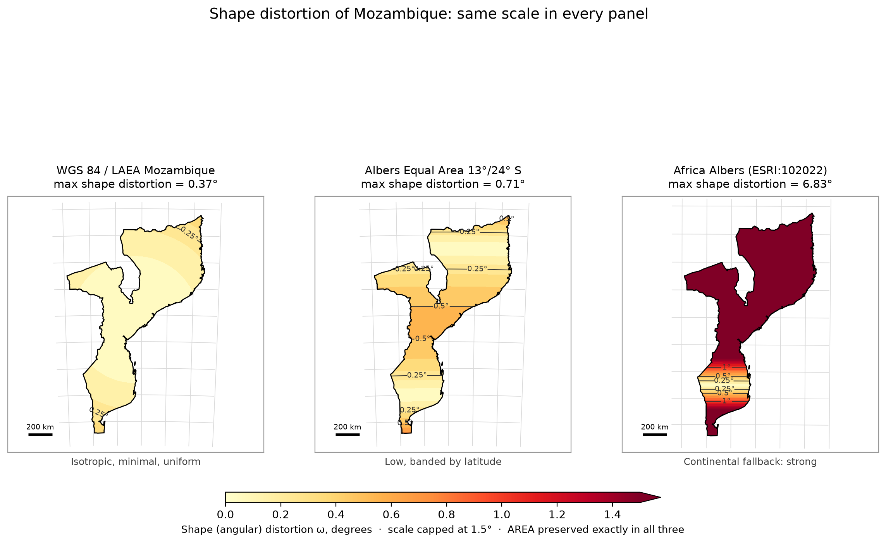

# WGS 84 / LAEA Mozambique

[](https://doi.org/10.5281/zenodo.21512485)

Reproduction package for a national equal-area projected coordinate reference
system for Mozambique, submitted as a change request to the IOGP EPSG Geodetic
Parameter Dataset.

The CRS is a Lambert Azimuthal Equal Area projection (EPSG method 9820) centred
on 18.5&deg;S, 35.5&deg;E, the midpoint of the national territory. It preserves
area exactly, removes the UTM 36S/37S zone seam, and keeps shape distortion
below 0.37&deg; over the onshore territory.

The defining technical note &mdash; the citable document &mdash; is deposited on
Zenodo: <https://doi.org/10.5281/zenodo.21512485>. **This repository holds the
code that computes every number, table and figure in that note.** The note
itself is written separately; the scripts here supply its quantitative content.



## What is here

| Path | Role |
|---|---|
| `reproduce.py` | Numeric core: distortion functions, the authoritative WKT2:2019, distortion tables and test points. Prints them and writes `output/results.csv`. |
| `figures.py` | Figure builders, importing the same functions. Writes the figures to `output/`. |
| `data/mozambique_boundary_ne10m.geojson` | National boundary (Natural Earth 1:10 m), SHA-256 verified at load. |
| `output/results.csv` | Every computed value, flat, versioned as a regression baseline. |
| `output/fig*.png` | The figures used in the note. |
| `submission/` | The IOGP EPSG data submission spreadsheet. |
| `references.bib` | Bibliography. |

## Reproduce the tables and figures

```bash
conda env create -f environment.yml
conda activate MZ_LAEA
python reproduce.py     # prints WKT2, tables and test points; writes output/results.csv
python figures.py       # writes the figures to output/ as PNG and PDF
```

The boundary file is hash-verified before use, so the statistics cannot change
silently if the upstream dataset is revised. Angular deformation is computed two
independent ways: from the PROJ Tissot factors (authoritative), and from the
singular values of the local Jacobian built from central geodesic differences,
which assumes nothing about the orientation of the Tissot axes. The two are
asserted to agree.

The note is authored by hand; only the tables and figures are produced by the
scripts above, so there is nothing to transcribe except the prose. Reproduced
independently on Linux with Python 3.12 and Windows with Python 3.13,
pyproj 3.7.2 / PROJ 9.5.1.

## License

CC-BY-4.0. See `LICENSE`.
